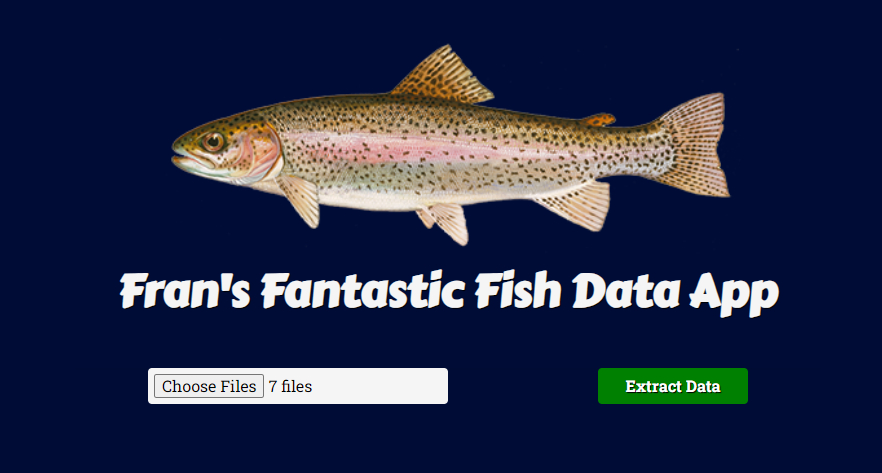

# Frans Fantastic Fish App

Frans Fantastic Fish App is a versatile tool designed for processing Google image JSON files exported from Google Takeout. The app extracts essential information, allowing users to generate a CSV for creating a heatmap showcasing when and where fish were caught.

## Table of Contents
- [Technologies Used](#technologies-used)
- [Installation](#installation)
- [Usage](#usage)
- [Contributing](#contributing)
- [Credits](#credits)
- [License](#license)
- [Contact Information](#contact-information)
- [Future Improvements](#future-improvements)

## Technologies Used
- HTML
- CSS
- JavaScript (FileReader, Blob [csvContent])
- Vite

## Installation
1. Clone the repository: `git clone https://github.com/your-username/frans-fantastic-fish-app.git`
2. Navigate to the project folder: `cd frans-fantastic-fish-app`
3. Install dependencies: `npm install`
4. Run the project: `npm run dev`

Example JSON files are included in the repo for reference.

## Usage
1. Upload Google image JSON files.
2. Click the submit button.
3. Download the newly created CSV.

## Contributing
Contributions and ideas are welcome. Please follow our [Contribution Guidelines](CONTRIBUTING.md).

## Credits
- [Vite](https://vitejs.dev/)

## License
This project is open source and available under the [MIT License](LICENSE).

## Contact Information
- LinkedIn: [Edward James O'Connor](https://www.linkedin.com/in/edwardjamesoconnor/)
- GitHub: [Your GitHub Profile](https://github.com/Eddie-OConnor)

## Future Improvements
App v2 will track all required information per fish and allow the user to take a picture when a fish is caught, eliminating the need for Google Photos and app v1. App v2 will track:
- Day Metrics: Number of anglers, date, water fished, area fished, time started, time ended, type of fishing (shore, boat, ice), target species.
- Fish Metrics: Picture, user's lat/long, species, catch/release, length, tag number, weight, missing fins, lamprey marks (yes/no).
